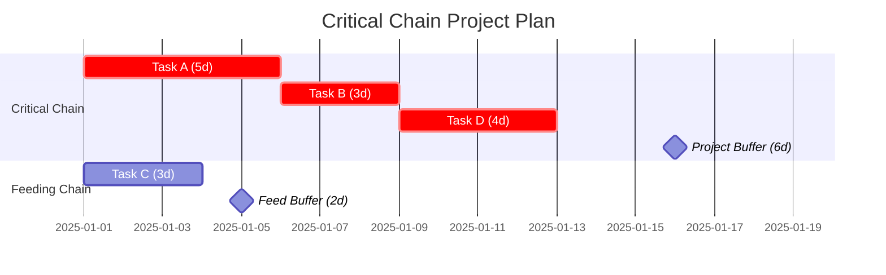

# Critical Chain Project Management Protocol

Plans projects by identifying the resource-constrained critical path,
removing hidden safety from individual tasks, and pooling safety into
shared buffers at strategic points.

From Goldratt's "Critical Chain" (1997).

## When This Tool Applies

- Projects consistently finish late despite generous estimates
- Individual tasks finish on time but the project is late
- Resources are shared across tasks/projects causing conflicts
- Multitasking is rampant — people work on 3+ projects simultaneously
- "Student syndrome" — work starts at the last possible moment
- Estimates keep growing because people pad for safety

## Core Insight

### Why Projects Are Late

Traditional project management lets each task owner add safety margin.
But this safety is WASTED because of three behaviors:

1. **Student Syndrome**: Work expands to fill the time. A 5-day task with 5 days of safety becomes a 10-day task that starts on day 5.

2. **Parkinson's Law**: Even if finished early, people don't report early (no reward for early, only punishment for late).

3. **Multitasking**: Switching between tasks destroys focus. Three 1-week tasks done sequentially take 3 weeks. Done in parallel (multitasking), they take 6+ weeks.

### The CCPM Solution

- **Cut individual task estimates by ~50%** (remove hidden safety)
- **Pool the safety into shared buffers** (statistically more efficient)
- **Manage by buffer consumption** (not by task due dates)

---

## Phase 1: Build the Network

### List Tasks

For each task:
- Name/description
- Duration estimate (the "safe" estimate people normally give)
- Resource(s) required
- Dependencies (which tasks must finish first)

### Find the Critical Path

Standard CPM (Critical Path Method): the longest chain of dependent tasks.

### Identify Resource Conflicts

Where the critical path uses the same resource as a parallel path:
- The resource creates a dependency even without a logical dependency
- Resolve by sequencing: the critical chain task goes first

### The Critical Chain

= Critical Path + resource dependency resolution

The Critical Chain is the LONGEST chain of tasks considering BOTH:
- Task dependencies (logical: A must finish before B)
- Resource dependencies (resource: A and C need the same person)

---

## Phase 2: Cut Estimates and Add Buffers

### Cut Task Estimates

For each task on the Critical Chain:
- Take the "safe" estimate (what people normally say)
- Cut to ~50% (the aggressive but possible estimate)
- This is the new task duration

**Rationale**: The safe estimate includes ~50% safety that gets wasted anyway. By pooling it, we use it more efficiently (statistical aggregation — not all tasks will need their safety).

### Project Buffer

Place at the END of the Critical Chain.

**Size**: 50% of the total Critical Chain duration (after cuts).

```
Critical Chain (after cuts): 30 days
Project Buffer: 15 days
Total: 45 days (vs. original 60+ days with padded estimates)
```

### Feeding Buffers

Place where non-critical chains JOIN the Critical Chain.

**Size**: 50% of the feeding chain duration (after cuts).

**Purpose**: Protect the Critical Chain from delays on feeding paths.

### Resource Buffers

Not time buffers — these are ALERTS.
Place before Critical Chain tasks that require a different resource than the previous task.

**Purpose**: Warn the resource "you're needed soon — be ready."

---

## Phase 3: Staggering (Multi-Project)

### The Problem

If multiple projects share the same constraint resource (the "drum resource"),
starting them all at once causes multitasking and delays.

### The Solution: Stagger by Drum Resource

1. Identify the most loaded resource across all projects (the drum)
2. Schedule that resource's tasks across projects — no overlap
3. Stagger project start dates based on when the drum resource is available

```
Project A: [    drum task    ][...................]
Project B:                    [    drum task    ][........]
Project C:                                       [    drum task    ][...]
```

### Full-Kit Check

Before starting any project:
- All inputs, specs, and materials must be available (the "full kit")
- Starting without a full kit = guaranteed delays and rework

---

## Phase 4: Buffer Management

### Buffer Zones

| Zone | Consumption | Task Status | Action |
|------|------------|-------------|--------|
| **Green** (0-33% consumed) | On track | Proceed normally | No action |
| **Yellow** (34-66% consumed) | Warning | Identify cause | Prepare recovery plan |
| **Red** (67-100% consumed) | Critical | Plan must activate | Execute recovery plan immediately |

### Fever Chart

Track buffer consumption vs. project completion:

```
Buffer     │  ╲
Consumed   │   ╲ RED
(%)        │    ╲─────────
   66% ────│     ╲ YELLOW
           │      ╲───────
   33% ────│       ╲ GREEN
           │        ╲─────
     0% ───┼────────────────
           0%     50%    100%
           Project Completion (%)
```

- Points in GREEN: project is healthy
- Points in YELLOW: monitor, prepare
- Points in RED: act now

### Status Reporting

Report by buffer status, not by task completion percentage.

```
PROJECT STATUS:
  Completion: 60%
  Project Buffer: [████████░░░░] 35% consumed (YELLOW)
  
  Feeding Buffers:
    Feed A: [██████████░░] 18% consumed (GREEN)
    Feed B: [████░░░░░░░░] 65% consumed (YELLOW) ⚠️
  
  Action items:
    - Feed B: [specific recovery action]
```

---

## Phase 5: Output

### Diagram (Mermaid)



### Summary

```
═══ CRITICAL CHAIN PROJECT PLAN ═══

PROJECT: [name]

CRITICAL CHAIN:
  Tasks: [list with cut durations]
  Total duration: [X] days (original: [Y] days)
  
PROJECT BUFFER: [size] days (placed at end)
FEEDING BUFFERS:
  - Feed from [chain]: [size] days
  - Feed from [chain]: [size] days

TOTAL PROJECT DURATION: [critical chain + project buffer] days
COMPARED TO TRADITIONAL: [original estimate] days
IMPROVEMENT: [X]% shorter with higher reliability

STAGGERING (if multi-project):
  Project A starts: [date]
  Project B starts: [date] (drum resource freed on [date])

KEY RULES:
  1. No task due dates — manage by buffer consumption
  2. No multitasking — finish one task before starting another
  3. Report: "task done" or "X days remaining" (not % complete)
  4. Early finishes are PASSED FORWARD immediately
  5. Green buffer = relax. Yellow = prepare. Red = act.
```

---

## Anti-Patterns

| Anti-Pattern | Why It's Wrong | Fix |
|-------------|---------------|-----|
| Restoring task safety | Defeats the purpose — back to padded estimates | Trust the buffer, not individual task estimates |
| Measuring task completion % | Invites Parkinson's Law and gaming | Ask only: "How many days remaining?" |
| Starting without full kit | Guaranteed rework and delays | Hard gate: no full kit = no start |
| Allowing multitasking | Destroys focus, extends all projects | One task at a time, relay-race handoffs |
| Ignoring buffer signals | Buffer management IS project management | Green/yellow/red drives ALL decisions |
| Punishing late tasks | Tasks WILL be late (50% cut!) — that's expected | Manage the project buffer, not individual tasks |
