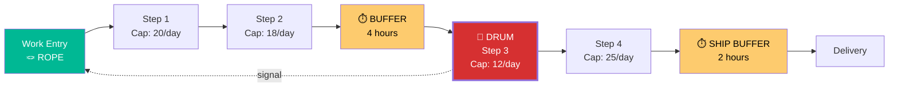

# Drum-Buffer-Rope Protocol

A scheduling and flow control system that synchronizes the entire production/service
process to the pace of its constraint (bottleneck).

From Goldratt's "The Goal" (1984) and "The Race" (1986).

## When This Tool Applies

- Work-in-progress (WIP) is growing uncontrollably
- Lead times are long and unpredictable
- Expediting and firefighting are constant
- Everyone is busy but output is disappointing
- You've identified the constraint (via Five Focusing Steps) and need a scheduling system

## Core Concept

Traditional scheduling pushes work into the system as fast as possible.
DBR PULLS work at the pace the constraint can handle.

**Three components:**

| Component | Analogy | Function |
|-----------|---------|----------|
| **Drum** | Drummer in a march | The constraint sets the pace for the entire system |
| **Buffer** | Gap between soldiers | Time buffer protects the constraint from disruptions |
| **Rope** | Rope connecting front to back | Signal that controls when new work enters the system |

---

## Phase 1: Map the Process Flow

### Identify All Steps

List the process steps from start to finish. For each step:
- Name/description
- Approximate processing time per unit
- Available capacity (units per time period)
- Current utilization (%)

### Identify the Drum (Constraint)

The constraint is the step with:
- Highest utilization (closest to 100%)
- Longest queue of waiting work
- Most complaints from downstream ("we're waiting for...")

```
PROCESS MAP:
  Step 1: [name] — capacity: [X]/day — utilization: [Y]%
  Step 2: [name] — capacity: [X]/day — utilization: [Y]%
  Step 3: [name] — capacity: [X]/day — utilization: [Y]% ← DRUM (CONSTRAINT)
  Step 4: [name] — capacity: [X]/day — utilization: [Y]%
  Step 5: [name] — capacity: [X]/day — utilization: [Y]%
```

---

## Phase 2: Size the Buffers

### Constraint Buffer (before the Drum)

Purpose: Ensure the constraint NEVER starves for work.

**Sizing rule**: Buffer = typical disruption recovery time × safety factor

| Disruption level | Buffer size |
|-----------------|-------------|
| Low (stable process) | 1-2x processing time at constraint |
| Medium (occasional issues) | 2-3x processing time at constraint |
| High (frequent disruptions) | 3-5x processing time at constraint |

Start with the larger estimate, then reduce as the system stabilizes.

### Shipping Buffer (before delivery)

Purpose: Ensure on-time delivery despite post-constraint disruptions.

Sizing: Similar logic — based on typical disruption after the constraint.

### Assembly Buffer (at merge points)

Purpose: When non-constraint parts must merge with constraint output.

Sizing: Enough time to ensure the non-constraint part is ALWAYS ready when constraint output arrives.

---

## Phase 3: Design the Rope

### Release Control

The Rope determines when new work enters the system.

**Rule**: Release new work = Drum rate - current buffer level

If buffer is full → slow down releases
If buffer is depleted → speed up releases (but investigate WHY)

### Implementation

```
NEW WORK RELEASE SIGNAL:
  Trigger: Constraint completes one unit
  Action: Release one new unit at the entrance
  Delay: [buffer time] before the constraint needs it
  
  Translation:
    If constraint processes 1 unit every [T] minutes,
    release 1 new unit every [T] minutes,
    starting [buffer time] before it's needed at the constraint.
```

### WIP Cap

Total system WIP = Buffer size + work actively being processed

If WIP exceeds this → STOP releasing new work until WIP drops.

---

## Phase 4: Buffer Management

### Buffer Zones

Divide each buffer into three zones:

| Zone | Buffer Penetration | Action |
|------|-------------------|--------|
| **Green** (0-33%) | Buffer is healthy | Normal operations, no action needed |
| **Yellow** (34-66%) | Buffer is being consumed | Monitor closely, prepare recovery |
| **Red** (67-100%) | Buffer is critical | Immediate action — expedite, add resources |

### Monitoring

Track buffer penetration over time:
- Consistently green → buffer may be too large (opportunity to reduce WIP)
- Frequent red → investigate causes (specific disruptions, capacity issues)
- Patterns → predictable disruptions should be prevented, not buffered

### Buffer Reporting

```
BUFFER STATUS DASHBOARD:
  
  Constraint Buffer: [████████░░] 78% remaining (GREEN)
  Shipping Buffer:   [██████░░░░] 62% remaining (GREEN)
  Assembly Buffer:   [███░░░░░░░] 31% remaining (YELLOW) ⚠️
  
  WIP: 47 units (cap: 55)
  Throughput: 12 units/day (target: 12)
  
  Alerts:
  - Assembly buffer entering yellow: Part XYZ delayed at Step 2
```

---

## Phase 5: Output

### Diagram (Mermaid)



### Summary

```
═══ DRUM-BUFFER-ROPE DESIGN ═══

SYSTEM: [process name]

DRUM (Constraint): [step name]
  Capacity: [X] units per [time]
  Current throughput: [Y] units per [time]

BUFFER (Constraint): [size in time]
  Zone thresholds: Green < [T1], Yellow < [T2], Red < [T3]

ROPE (Release Rule):
  Release rate: [X] units per [time] (matches drum)
  WIP cap: [N] units
  Signal: [how new work is triggered]

SHIPPING BUFFER: [size in time]

EXPECTED IMPROVEMENTS:
  Lead time: [current] → [expected] (reduction: X%)
  WIP: [current] → [expected] (reduction: X%)
  On-time delivery: [current]% → [expected]%
  
SCHEDULING RULES:
  1. [rule]
  2. [rule]
  3. [rule]
```

---

## Simplified DBR (S-DBR)

For simpler systems where the constraint is obvious:

Skip the detailed buffer sizing and use:
1. **Constraint schedule**: Schedule the constraint first, everything else follows
2. **WIP cap**: Limit total work-in-progress
3. **Priority**: Red buffer items first, yellow next, green last

This is often sufficient for service businesses and software teams.

---

## Anti-Patterns

| Anti-Pattern | Why It's Wrong | Fix |
|-------------|---------------|-----|
| Pushing work faster | More WIP = longer lead times | Control releases with the Rope |
| Buffer too large | Hides problems, inflates lead time | Gradually reduce; investigate what penetrates |
| Buffer too small | Constraint starves, throughput drops | Start larger, reduce as system stabilizes |
| Ignoring buffer signals | Yellow/red zones are early warnings | Act immediately on red; investigate yellow patterns |
| Scheduling non-constraints | Wasted effort — they have excess capacity | Only schedule the constraint; subordinate the rest |
