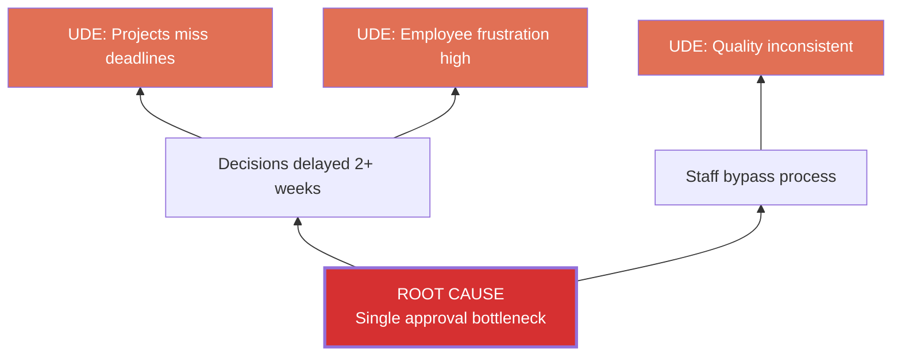
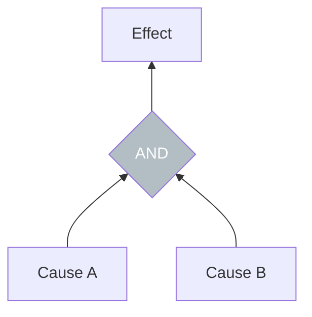
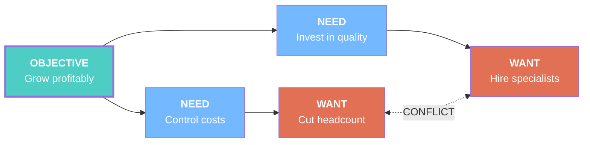
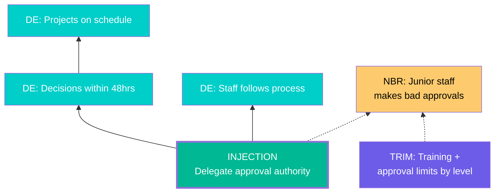
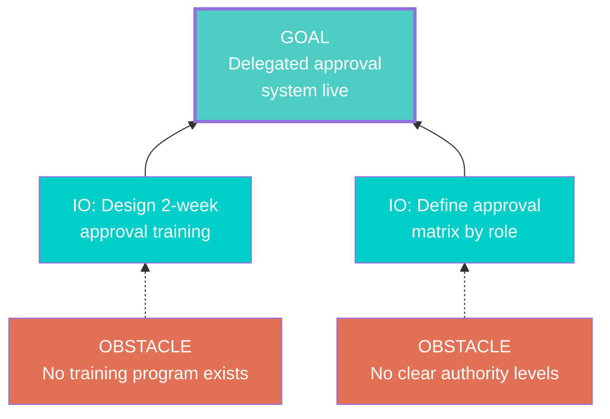
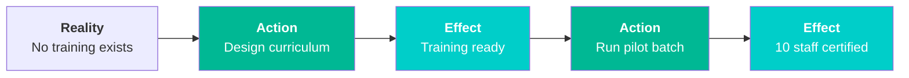
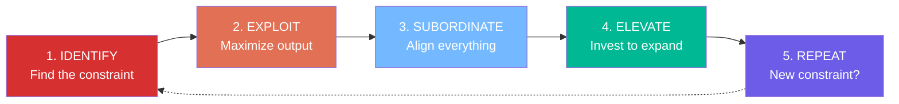

# Output Format Specification

All TOC tools render their output in two formats: Mermaid (default) and ASCII.

## Format Selection

- Default: `mermaid` — renders in GitHub, VS Code, and most Markdown viewers
- Alternative: `ascii` — universal text fallback, works everywhere
- Controlled by `--format mermaid|ascii` argument

## Color Conventions (Mermaid)

| Element | Color | Style Code |
|---------|-------|-----------|
| UDE (Undesirable Effect) | Coral red | `fill:#e17055,color:#fff` |
| Root Cause | Dark red, thick border | `fill:#d63031,color:#fff,stroke-width:3px` |
| Injection | Green, thick border | `fill:#00b894,color:#fff,stroke-width:3px` |
| Desirable Effect | Teal | `fill:#00cec9,color:#fff` |
| NBR (Negative Branch) | Yellow warning | `fill:#fdcb6e,color:#000` |
| Trim (NBR prevention) | Purple | `fill:#6c5ce7,color:#fff` |
| Objective/Goal | Teal, thick border | `fill:#4ecdc4,color:#fff,stroke-width:3px` |
| Need (EC) | Light blue | `fill:#74b9ff,color:#fff` |
| Normal entity | Default | (no special styling) |
| AND connector | Gray diamond | `fill:#b2bec3,color:#fff` |

## Mermaid Templates

### Current Reality Tree (CRT)

Direction: `graph BT` (bottom-to-top — root causes at bottom, UDEs at top)



With AND connector:


### Evaporating Cloud (EC)

Direction: `graph LR` (left-to-right — objective on left, wants on right)



### Future Reality Tree (FRT)

Direction: `graph BT` (bottom-to-top — injection at bottom, desirable effects at top)



### Prerequisite Tree (PRT)

Direction: `graph BT` (bottom-to-top — obstacles at bottom, goal at top)



### Transition Tree (TT)

Direction: `graph LR` (left-to-right — sequential steps)



### Five Focusing Steps

Direction: `graph LR` (left-to-right — cyclical)



## ASCII Templates

### Current Reality Tree
```
═══ CURRENT REALITY TREE ═══

[!] UDE 1: Projects miss deadlines
     ↑
  Decisions delayed 2+ weeks
     ↑
[ROOT] Single approval bottleneck ──→ Staff bypass process
                                           ↓
                                    [!] UDE 2: Quality inconsistent

Root Causes: 1
UDEs Explained: 3/3
```

### Evaporating Cloud
```
═══ EVAPORATING CLOUD ═══

    ┌─[A] Grow profitably──────────────────────────┐
    │                                               │
    ├─[B] Control costs ────→ [D] Cut headcount     │
    │                              ↕ CONFLICT       │
    └─[C] Invest in quality → [D'] Hire specialists │
                                                    │
BROKEN ASSUMPTION (B→D):                            │
  "Headcount is the only controllable cost"         │
                                                    │
INJECTION: Automate manual processes instead        │
════════════════════════════════════════════════════╝
```

### Future Reality Tree
```
═══ FUTURE REALITY TREE ═══

  [✓] DE: Projects on schedule
       ↑
  [✓] DE: Decisions within 48hrs
       ↑
  [+] INJECTION: Delegate approval authority
       │
       ├──→ [⚠] NBR: Junior staff makes bad approvals
       │         └── [TRIM] Training + approval limits by level
       │
       └──→ [✓] DE: Staff follows process
```

### Prerequisite Tree
```
═══ PREREQUISITE TREE ═══

  [GOAL] Delegated approval system live
       ↑                    ↑
  [IO] Design training  [IO] Define approval matrix
       ↑                    ↑
  [OBS] No training     [OBS] No clear authority
        program exists        levels defined
```

### Transition Tree
```
═══ TRANSITION TREE ═══

Step 1: [Reality] No training exists
        [Action]  Design curriculum
        [Effect]  Training program ready
            ↓
Step 2: [Reality] Training ready, no one trained
        [Action]  Run pilot batch
        [Effect]  10 staff certified
            ↓
Step 3: ...
```

## Rendering Rules

1. **Always include a title** — `═══ TOOL NAME ═══` for ASCII, `%% Tool: NAME` comment for Mermaid
2. **Always include a summary** after the diagram with key counts (UDEs, root causes, injections, etc.)
3. **Mermaid node IDs** — use short, semantic names (ROOT1, UDE1, INJ1, DE1, NBR1, etc.)
4. **Mermaid line breaks** — use `<br/>` for multi-line node text
5. **Bold labels** — use `<b>LABEL</b>` in Mermaid for entity type labels
6. **Conflict arrows** — always dotted: `<-. "CONFLICT" .->`
7. **NBR arrows** — always dotted: `-.->` (negative/uncertain connection)
8. **Obstacle arrows** — dotted from obstacle to IO: `-.->` (obstacle motivates the IO)
9. **Normal arrows** — solid: `-->` (confirmed cause-effect or necessity)
10. **Maximum nodes per diagram** — shallow: 8-12, deep: 15-25. Split into sub-diagrams if needed.
