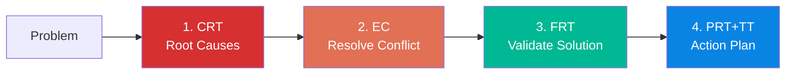

# toc-agents

[한국어 README](README.ko.md)

**The complete Goldratt Theory of Constraints framework as Claude Code skills.**

The first open-source implementation of TOC Thinking Processes, operations tools, and decision frameworks as AI agent skills. No external dependencies — copy the `.claude/` folder into any project and start analyzing.

## What is TOC?

The Theory of Constraints (TOC), created by Eliyahu M. Goldratt, is a management philosophy that views any system as limited by a small number of constraints. TOC provides systematic tools for identifying constraints, resolving conflicts, and driving continuous improvement.

> "Any improvement NOT at the constraint is an illusion." — Goldratt, *The Goal*

## Available Tools

### Thinking Processes (Problem Solving)

| Command | Tool | What it does | Based on |
|---------|------|-------------|----------|
| `/toc "problem"` | **Full Workflow** | CRT → EC → FRT → PRT → TT pipeline | All books |
| `/toc:crt` | **Current Reality Tree** | Find root causes from symptoms | *It's Not Luck* |
| `/toc:ec` | **Evaporating Cloud** | Resolve conflicts by breaking assumptions | *It's Not Luck* |
| `/toc:frt` | **Future Reality Tree** | Validate solutions, find side-effects | *It's Not Luck* |
| `/toc:prt` | **Prerequisite Tree** | Identify obstacles and intermediate objectives | *It's Not Luck* |
| `/toc:tt` | **Transition Tree** | Step-by-step action plan | *It's Not Luck* |

### Operations & Strategy

| Command | Tool | What it does | Based on |
|---------|------|-------------|----------|
| `/toc:five-steps` | **Five Focusing Steps** | Identify and exploit the bottleneck | *The Goal* |
| `/toc:dbr` | **Drum-Buffer-Rope** | Pull-based scheduling around constraint | *The Goal* / *The Race* |
| `/toc:ccpm` | **Critical Chain PM** | Project planning with shared buffers | *Critical Chain* |
| `/toc:throughput` | **Throughput Accounting** | T/I/OE decision framework | *The Haystack Syndrome* |
| `/toc:buy-in` | **Layers of Resistance** | Overcome resistance to change (6 layers) | *It's Not Luck* |

## Installation

### Option 1: Copy into your project

```bash
# Clone this repo
git clone https://github.com/ironyjk/toc-agents.git

# Copy .claude/ folder into your project
cp -r toc-agents/.claude/commands/toc* your-project/.claude/commands/
cp -r toc-agents/.claude/skills/toc your-project/.claude/skills/
```

### Option 2: Use directly

```bash
cd toc-agents
claude   # Start Claude Code in this directory
```

Then invoke any command:
```
/toc "Our projects keep finishing late despite having enough resources"
```

## Quick Start

### Resolve a Conflict

```
/toc:ec "We need to cut costs to survive, but we also need to invest in quality to keep customers"
```

Output: Evaporating Cloud diagram with broken assumptions and injection.

### Find Root Causes

```
/toc:crt "Delivery is late, quality is dropping, employees are quitting, customers are complaining"
```

Output: Current Reality Tree tracing all symptoms to 1-2 root causes.

### Full Analysis Pipeline

```
/toc "Revenue has plateaued at $10M despite growing the team from 20 to 30 people"
```

Output: Complete analysis through all 5 stages — root causes, conflict resolution, solution validation, and action plan.

### Evaluate a Decision

```
/toc:throughput "Should we accept this $50K order that uses 20 hours of our bottleneck machine?"
```

Output: Throughput Accounting analysis with T/I/OE comparison.

## How the Full Workflow Works



The full workflow uses a **4-agent sequential pipeline**:

1. **CRT Agent** (Sonnet) — Identifies root causes from symptoms
2. **EC Agent** (Opus) — Resolves the core conflict by breaking hidden assumptions  
3. **FRT Agent** (Opus) — Validates the solution and trims negative side-effects
4. **PRT+TT Agent** (Sonnet) — Creates an implementation roadmap with detailed steps

Each agent's output feeds into the next. The coordinator synthesizes everything into a final report.

## Output Formats

All tools output in **Mermaid** (default) or **ASCII** format:

```
/toc:ec "speed vs quality" --format ascii
```

Mermaid diagrams render natively in GitHub, VS Code, and most Markdown viewers.

## Theory Background

See [docs/goldratt-background.md](docs/goldratt-background.md) for a comprehensive overview of TOC, Goldratt's books, and the intellectual foundations.

## Examples

- [Business Dilemma](examples/business-dilemma.md) — Classic cost vs. quality conflict (EC)
- [Production Bottleneck](examples/production-bottleneck.md) — Manufacturing throughput (Five Steps + DBR)
- [Software Architecture](examples/software-architecture.md) — Monolith vs. microservices (Full Workflow)
- [Startup Scaling](examples/startup-scaling.md) — Growth vs. culture (EC + CCPM)

## Roadmap

### v1.0 (Current)
- [x] 6 Thinking Process tools (CRT, EC, FRT, PRT, TT, Five Steps)
- [x] 4 Operations/Strategy tools (DBR, CCPM, Throughput Accounting, Buy-in)
- [x] Full workflow pipeline with multi-agent orchestration
- [x] Mermaid + ASCII output

### v2.0 (Planned)
- [ ] **OR-Tools integration** for computational optimization:
  - **Product Mix LP** — linear programming to maximize throughput given constraint capacity (`/toc:throughput --solve`)
  - **DBR Scheduling** — constraint-based job scheduling with CP-SAT solver (`/toc:dbr --optimize`)
  - **CCPM Resource Leveling** — multi-project resource allocation with staggering optimization
  - **Buffer Sizing** — Monte Carlo simulation for optimal buffer sizes
  - Uses Google [OR-Tools](https://developers.google.com/optimization) (Python) — Claude Code generates and runs solver scripts automatically
- [ ] Strategy & Tactics Tree (S&T Tree) — Goldratt's strategic planning tool
- [ ] Viable Vision analysis — "Can every company achieve viable vision?"
- [ ] Interactive mode — step-by-step guided analysis with user input at each phase
- [ ] MCP server — expose TOC tools as MCP resources for cross-project use

### Why OR-Tools?

Several TOC concepts have precise mathematical formulations:

| TOC Concept | Mathematical Model | OR-Tools Solver |
|-------------|-------------------|-----------------|
| Product Mix (T/CU ranking) | Linear Programming | `pywraplp` |
| DBR Scheduling | Constraint Programming | `cp_model` (CP-SAT) |
| CCPM Resource Leveling | Resource-Constrained Scheduling | `cp_model` |
| Buffer Sizing | Monte Carlo Simulation | Python + numpy |
| Routing (multi-site) | Vehicle Routing Problem | `routing` |

The Thinking Processes (CRT, EC, FRT, etc.) are qualitative reasoning tools best handled by LLMs. The operations tools (DBR, CCPM, Throughput Accounting) benefit from combining LLM reasoning with mathematical optimization. v2.0 will bridge both worlds.

## Contributing

Contributions welcome! Areas where help is needed:

1. **Domain-specific examples** — manufacturing, healthcare, education, government
2. **OR-Tools integration** — mathematical optimization for DBR scheduling and product mix
3. **Translations** — Korean, Japanese, Chinese, German, Portuguese
4. **Testing** — run the tools against real problems and report quality

## Author

**Heechul Choi** — CEO, DY Industrial Development  
Co-created with [Claude Code](https://claude.ai/claude-code) (Anthropic Claude Opus 4.6)

## License

[MIT](LICENSE)

## Acknowledgments

- **Eliyahu M. Goldratt** (1947–2011) — creator of the Theory of Constraints
- The TOC community for decades of practice and refinement
- Inspired by [autoresearch](https://github.com/ironyjk/dy-insight) — autonomous iteration framework for Claude Code
