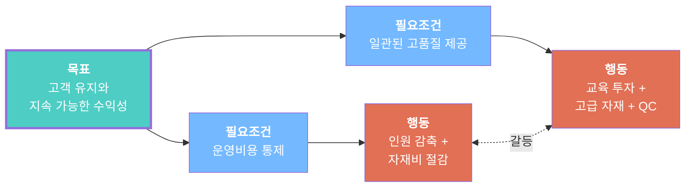

# 예제: 비즈니스 딜레마 — 비용 절감 vs 품질 투자

## 문제

> "수익성을 높이려면 비용을 줄여야 하지만, 고객을 유지하려면 품질에 투자해야 합니다. 비용을 줄이면 품질이 떨어지고 고객이 이탈합니다. 품질에 투자하면 비용이 올라가고 마진이 줄어듭니다."

## 사용 도구: `/toc:ec`

## 증발하는 구름

## 표면화된 가정

### 화살표 B→D: "비용을 통제하려면 인원과 자재비를 줄여야 한다"
1. **인건비와 자재비가 가장 큰 통제 가능 비용이다** ← 아마 사실
2. **비용을 줄이는 다른 방법은 없다** ← 의심스러움
3. **줄여도 매출 창출 능력에 영향 없다** ← 의심스러움
4. **모든 인건비가 동일하게 간접비에 기여한다** ← 아마 거짓

### 화살표 C→D': "품질을 높이려면 더 투자해야 한다"
1. **품질에는 고가 자재가 필요하다** ← 부분적 사실
2. **더 많은 인력이나 교육이 필요하다** ← 의심스러움
3. **현재 프로세스로는 같은 비용에 더 높은 품질이 불가능하다** ← 의심스러움
4. **품질 문제의 원인이 투자 부족이다** ← 아마 거짓

### 화살표 D↔D': "비용 절감과 추가 투자를 동시에 할 수 없다"
1. **예산이 고정되어 있다** ← 흔히 가정하지만 거의 사실이 아님
2. **비용 절감과 품질 투자가 같은 재원에서 나온다** ← 의심스러움
3. **품질을 높이면서 비용도 줄이는 방법은 없다** ← **거짓**

## 깨진 가정

**화살표 D↔D', 가정 #3**: "품질을 높이면서 비용도 줄이는 방법은 없다"

이것은 거짓입니다. **프로세스 개선** (재작업 제거, 원천에서 불량 감소, 절차 표준화)은 동시에:
- 비용을 줄이고 (낭비 감소, 재작업 감소, 보증 비용 감소)
- 품질을 높입니다 (불량 감소, 일관성 향상)

## 인젝션 (해결책)

> **비용 절감이나 품질 투자 중 하나를 선택하는 대신, 프로세스 개선과 불량 예방에 투자하라.**

구체적으로:
1. 재작업과 낭비가 발생하는 곳 분석 (파레토 분석)
2. 상위 3개 불량 원천의 근본원인 해결
3. 성공한 절차 표준화
4. 측정: 품질 비용 (예방 + 평가 + 실패 비용)

## 평가

| 기준 | 등급 |
|------|------|
| 실행 가능성 | 높음 — 대규모 투자가 아닌 분석과 규율 필요 |
| 영향력 | 완전 — 갈등 자체가 소멸 |
| 속도 | 보통 — 3-6개월 내 측정 가능한 결과 |
| 리스크 | 낮음 — 점진적, 되돌릴 수 있는 변화 |

**다음 단계**: `/toc:frt`로 부작용 검증
