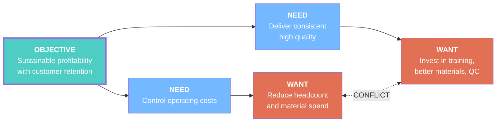

# Example: Business Dilemma — Cost vs. Quality

## Problem

> "We need to cut costs to improve profitability, but we also need to invest in quality to retain customers. Every time we cut costs, quality drops and we lose clients. Every time we invest in quality, costs rise and margins shrink."

## Tool Used: `/toc:ec`

## Evaporating Cloud

## Assumptions Surfaced

### Arrow B→D: "To control costs, we must reduce headcount and material spend"
1. **Labor and materials are our largest controllable costs** ← likely true
2. **There are no other ways to reduce costs** ← QUESTIONABLE
3. **Reducing these won't affect our ability to generate revenue** ← QUESTIONABLE
4. **All labor contributes equally to overhead** ← likely false

### Arrow C→D': "To deliver quality, we must invest more"
1. **Quality requires expensive materials** ← partially true
2. **Quality requires more people or more training** ← QUESTIONABLE
3. **Our current processes cannot produce higher quality at current cost** ← QUESTIONABLE
4. **Quality problems are caused by insufficient investment** ← likely false

### Arrow D↔D': "We can't reduce costs AND invest more simultaneously"
1. **The budget is fixed** ← often assumed, rarely true
2. **Cost reduction and quality investment draw from the same pool** ← QUESTIONABLE
3. **There's no way to improve quality that also reduces costs** ← FALSE

## Broken Assumption

**Arrow D↔D', Assumption #3**: "There's no way to improve quality that also reduces costs"

This is false. **Process improvement** (eliminating rework, reducing defects at source, standardizing procedures) simultaneously:
- Reduces costs (less waste, less rework, fewer warranty claims)
- Improves quality (fewer defects, more consistent output)

## Injection

> **Invest in process improvement and defect prevention rather than choosing between cost-cutting and quality spending.**

Specifically:
1. Analyze where rework and waste occur (Pareto analysis)
2. Fix the top 3 sources of defects at the root cause
3. Standardize successful procedures
4. Measure: Cost of Quality (prevention + appraisal + failure costs)

## Assessment

| Criterion | Rating |
|-----------|--------|
| Feasibility | High — requires analysis and discipline, not major investment |
| Impact | Full — dissolves the conflict entirely |
| Speed | Medium — 3-6 months for measurable results |
| Risk | Low — incremental, reversible changes |

**Next step**: Validate with `/toc:frt` to check for negative side-effects.
