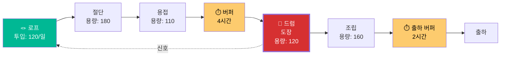

# 예제: 생산 병목 — 제조 쓰루풋

## 문제

> "공장 생산량이 하루 100개인데 주문은 150개입니다. 생산 공정이 5단계인데 모든 사람이 바쁩니다. 야근을 해도 크게 달라지지 않습니다. 주문을 놓치고 고객이 불만을 토로합니다."

## 사용 도구: `/toc:five-steps` + `/toc:dbr`

---

## 5단계 집중 프로세스 분석

### 1단계: 식별 (IDENTIFY)

| 공정 | 용량 (개/일) | 가동률 | 대기 (개) |
|------|-------------|--------|----------|
| 절단 | 180 | 56% | 0 |
| 용접 | 110 | 91% | 12 |
| **도장** | **100** | **100%** | **35** |
| 조립 | 160 | 63% | 0 |
| 검사 | 200 | 50% | 0 |

**제약 식별**: 도장 (3공정)
- 용량: 100개/일 (최저)
- 가동률: 100% (한계)
- 대기열: 35개 (최대 적체)

### 2단계: 활용 (EXPLOIT)

도장 공정의 현재 낭비:
- 색상 교체로 45분/일 손실 (3회 × 15분)
- 도장품의 8%가 재작업 필요 (다시 도장)
- 점심시간 30분 동안 부스 미가동

**활용 조치** (투자 없음):

| 조치 | 회수 시간 | 추가 생산 |
|------|----------|----------|
| 색상별 배치로 교체 횟수 감소 (3→1회/일) | +30분/일 | +6개 |
| 도장 전 품질 관문 (불량 사전 차단) | +8% 용량 | +8개 |
| 점심 교대 (도장원 2가 커버) | +30분/일 | +6개 |
| **합계** | | **+20개/일** |

새 쓰루풋: **120개/일** (+20%)

### 3단계: 종속 (SUBORDINATE)

| 공정 | 현재 행동 | 새 행동 |
|------|----------|---------|
| 절단 | 180개/일 생산 (재고 쌓임) | 120개/일만 생산 (도장에 맞춤) |
| 용접 | 아무 순서로 처리 | 도장 스케줄에 맞춰 우선순위 |
| 조립 | 도장 완료 대기 | 버퍼: 도장품 4시간분 유지 |
| 검사 | 들어오는 대로 검사 | 변경 없음 (여유 용량) |

**측정 중단**: 개별 공정 효율
**측정 시작**: 시스템 쓰루풋 (일 출하량)

### 4단계: 확장 (ELEVATE) — 120개/일이 부족한 경우

| 옵션 | 비용 | 용량 증가 | 쓰루풋 |
|------|------|----------|--------|
| 도장 야간 교대 추가 | 400만원/월 | +50개/일 | 150/일 |
| 도장 부스 2호 | 8,000만원 일시 | +100개/일 | 200/일 |
| 도장 외주 | 5,000원/개 | +30개/일 | 150/일 |

**권고**: 야간 교대 먼저 (저투자, 빠른 실행). 부스 2호는 수요 150+ 지속 시.

### 5단계: 반복 (REPEAT)

야간 교대 추가 후 (도장 용량 → 150/일):
- 새 제약은 **용접** (용량 110)으로 이동 예상
- 계획: 용접에 5단계 재적용

---

## 드럼-버퍼-로프 설계

### 스케줄링 규칙

1. **투입**: 도장이 용량 신호를 보낼 때만 새 작업 시작 (최대 120개/일)
2. **WIP 상한**: 시스템 내 최대 60개
3. **우선순위**: 버퍼 적색(>67% 소모) 시 비제약 공정에서 긴급 처리
4. **색상 배치**: 같은 색상 묶어서 도장 — 하루 교체 최대 1회

## 결과 요약

| 지표 | 이전 | 활용 후 | 종속 후 |
|------|------|---------|---------|
| 쓰루풋 | 100/일 | 120/일 | 120/일 |
| 리드타임 | 8일 | 5일 | 3일 |
| 재공품(WIP) | 120개 | 80개 | 60개 |
| 납기 준수율 | 71% | 85% | 94% |
| 야근 비용 | 600만/월 | 0 | 0 |
