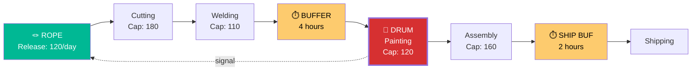

# Example: Production Bottleneck — Manufacturing Throughput

## Problem

> "Our factory produces 100 units per day but orders require 150. We have 5 production stages. Everyone seems busy. Adding overtime didn't help much. We're losing orders and customers are frustrated."

## Tools Used: `/toc:five-steps` + `/toc:dbr`

---

## Five Focusing Steps Analysis

### Step 1: IDENTIFY

| Stage | Capacity (units/day) | Utilization | Queue (units) |
|-------|---------------------|-------------|---------------|
| Cutting | 180 | 56% | 0 |
| Welding | 110 | 91% | 12 |
| **Painting** | **100** | **100%** | **35** |
| Assembly | 160 | 63% | 0 |
| Testing | 200 | 50% | 0 |

**Constraint identified**: Painting (Stage 3)
- Capacity: 100 units/day (lowest)
- Utilization: 100% (maxed out)
- Queue: 35 units waiting (largest backlog)

### Step 2: EXPLOIT

Current waste at the painting station:
- 45 minutes/day lost to color changeovers (3 changeovers × 15 min)
- 8% of painted items need rework (sent back through painting)
- 30-minute lunch break where the booth is idle

**Exploitation actions** (zero investment):

| Action | Time Recovered | Units Gained |
|--------|---------------|-------------|
| Batch by color to reduce changeovers (3→1/day) | +30 min/day | +6 units |
| Quality gate BEFORE painting (catch defects earlier) | +8% capacity | +8 units |
| Stagger lunch breaks (painter 2 covers) | +30 min/day | +6 units |
| **Total** | | **+20 units/day** |

New throughput: **120 units/day** (+20%)

### Step 3: SUBORDINATE

| Stage | Current Behavior | New Behavior |
|-------|-----------------|-------------|
| Cutting | Produces 180/day (piles up inventory) | Produce only 120/day (match painting) |
| Welding | Processes in any order | Prioritize by painting schedule |
| Assembly | Waits for painted parts | Buffer: maintain 4-hour supply of painted parts |
| Testing | Tests as items arrive | No change (excess capacity) |

**Stop measuring**: Individual stage efficiency
**Start measuring**: System throughput (units shipped per day)

### Step 4: ELEVATE (if 120/day is insufficient)

| Option | Cost | Capacity Gain | Throughput |
|--------|------|---------------|-----------|
| Add night shift for painting | $4K/month | +50 units/day | 150/day |
| Second paint booth | $80K one-time | +100 units/day | 200/day |
| Outsource painting overflow | $5/unit | +30 units/day | 150/day |

**Recommended**: Add night shift first (low investment, quick). Second booth only if demand sustains 150+.

### Step 5: REPEAT

After adding night shift (painting capacity → 150/day):
- New constraint likely moves to **Welding** (capacity 110)
- Plan: Apply Five Steps to Welding next

---

## Drum-Buffer-Rope Design



### Scheduling Rules

1. **Release**: Start new work only when Painting signals capacity (120 units/day max)
2. **WIP Cap**: Maximum 60 units in the system at any time
3. **Priority**: If buffer is red (>67% consumed), expedite at all non-constraints
4. **Color batching**: Group painting orders by color — max 1 changeover per day

### Buffer Management

```
Constraint Buffer: [████████████░░░░] 75% remaining (GREEN)
Shipping Buffer:   [██████████░░░░░░] 62% remaining (GREEN)

WIP: 42 units (cap: 60)
Throughput: 118 units/day (target: 120)
On-time delivery: 94% (was 71%)
```

## Results Summary

| Metric | Before | After Exploit | After Subordinate |
|--------|--------|--------------|-------------------|
| Throughput | 100/day | 120/day | 120/day |
| Lead time | 8 days | 5 days | 3 days |
| WIP | 120 units | 80 units | 60 units |
| On-time delivery | 71% | 85% | 94% |
| Overtime cost | $6K/month | $0 | $0 |
