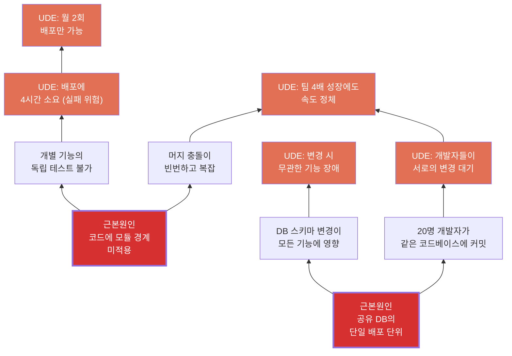
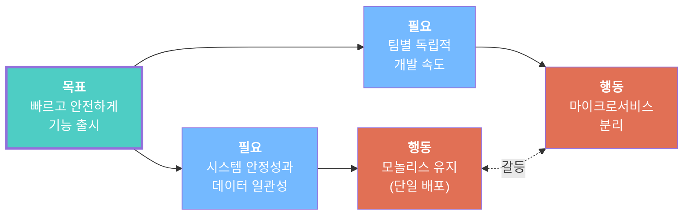

# 예제: 소프트웨어 아키텍처 — 모놀리스 vs 마이크로서비스

## 문제

> "모놀리식 애플리케이션이 유지보수 불가능해지고 있습니다. 배포에 4시간 걸리고 월 2회만 합니다. 어떤 변경이든 무관한 기능이 깨질 위험이 있습니다. 개발자를 5명에서 20명으로 늘렸는데 속도는 안 빨라졌습니다. 마이크로서비스로 전환해야 한다는 의견과 재앙이 될 거라는 의견이 갈립니다."

## 사용 도구: `/toc` (전체 워크플로우)

---

## 1단계: 현재현실트리

**근본원인**:
1. 공유 DB의 단일 배포 단위 (4개 UDE 설명)
2. 코드에 모듈 경계 미적용 (3개 UDE 설명)

---

## 2단계: 증발하는 구름

**깨진 가정**:

- B→D: "시스템 안정성에는 단일 배포가 필요하다" → **거짓**. 안정성은 테스트, 계약, 관찰성에서 오지 배포 단위 수에서 오지 않음.
- C→D': "독립적 속도에는 별도 서비스가 필요하다" → **거짓**. 독립적 속도에는 명확한 모듈 경계가 필요하며, 이는 단일 코드베이스 내에서 가능함 (모듈러 모놀리스).

**인젝션**: 분산 시스템의 운영 복잡성 없이, **강제된 모듈 경계 + 독립 테스트 + 모듈별 배포가 가능한 모듈러 모놀리스**

---

## 3단계: 미래현실트리

**평가**: 조건부 진행 (PROCEED WITH CONDITIONS)
- 5개 DE가 모든 원래 UDE 해소
- 2개 NBR 식별, 모두 트리밍됨
  - NBR1: 개발자들이 새 모듈 경계에 저항 → 트림: 2-3개 자연스러운 경계부터 시작
  - NBR2: 모듈 간 기능이 어려워짐 → 트림: 공유 커널 패턴 적용

---

## 4단계: 실행 계획

| 장애물 | 중간목표 |
|--------|---------|
| 명확한 모듈 경계 없음 | 3개 도메인 경계 식별 |
| 공유 DB, 스키마 소유자 없음 | 모듈별 스키마 소유권 배정 |
| 독립 테스트 스위트 없음 | 모듈별 테스트 러너 생성 |
| 팀이 모듈러 패턴 모름 | 2일 워크숍 실시 |
| 모듈별 배포 파이프라인 없음 | 피처 플래그 + 모듈별 CI |

### 실행 단계

**Phase 1 (1-2주)**: 기존 코드를 3개 도메인 모듈로 매핑 (users, orders, billing)

**Phase 2 (3-4주)**: 가장 작고 독립적인 billing 모듈 먼저 추출

**Phase 3 (5-8주)**: orders, users 모듈 추출

**Phase 4 (9-10주)**: 피처 플래그 + 모듈별 CI 파이프라인 → 독립 배포

---

## 핵심 메시지

진짜 갈등은 "모놀리스 vs 마이크로서비스"가 아닙니다. 근본원인은 **모듈 경계 부재**와 **단일 배포 단위** — 분산 시스템 복잡성 없이 해결 가능합니다.

**모듈러 모놀리스**:
- 마이크로서비스보다 **빠른** 구현 (개월이 아닌 주)
- **낮은** 리스크 (분산 시스템 문제 없음)
- **되돌릴 수 있음** (정말 필요하면 나중에 분리 가능)
- 5개 UDE **전부** 해소

**월요일부터 시작**: 3개 도메인 모듈 매핑. billing부터 추출.
