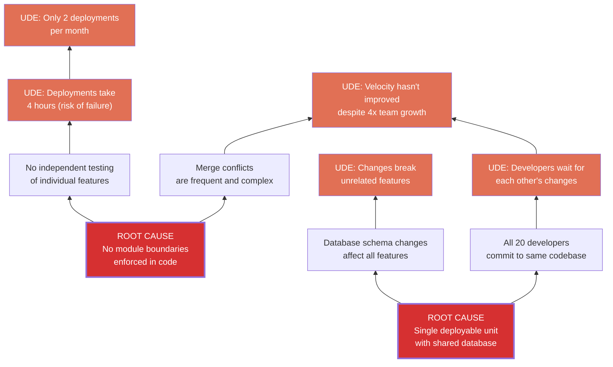
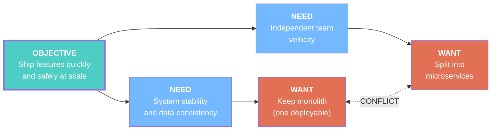
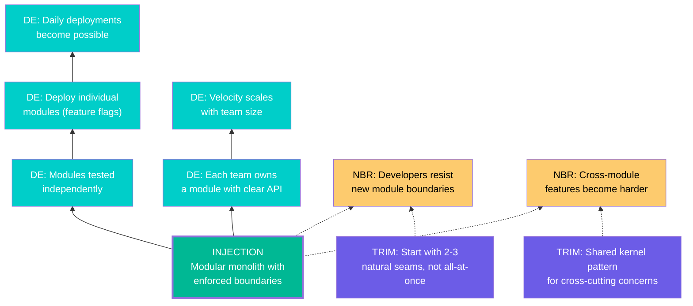

# Example: Software Architecture — Monolith vs. Microservices

## Problem

> "Our monolithic application is becoming unmaintainable. Deployments take 4 hours and happen only twice a month. Any change risks breaking unrelated features. The team has grown from 5 to 20 developers but velocity hasn't improved. Some say we should migrate to microservices. Others say it'll be a disaster."

## Tool Used: `/toc` (Full Workflow)

---

## Stage 1: Current Reality Tree

**Root Causes**:
1. Single deployable unit with shared database (explains 4 UDEs)
2. No module boundaries enforced in code (explains 3 UDEs)

**Core Conflict**: "We need deployment independence, but the codebase is monolithic."

---

## Stage 2: Evaporating Cloud

**Key assumptions broken**:

- Arrow B→D: "System stability requires a single deployable" → **FALSE**. Stability comes from testing, contracts, and observability — not from having one deployment unit.
- Arrow C→D': "Independent velocity requires separate services" → **FALSE**. Independent velocity requires clear module boundaries. These CAN exist within a single codebase (modular monolith).

**Injection**: 

> **Modular monolith with enforced module boundaries, independent test suites, and per-module deployment capability — without the operational complexity of distributed systems.**

---

## Stage 3: Future Reality Tree

**Assessment**: PROCEED WITH CONDITIONS
- 5 DEs address all original UDEs
- 2 NBRs identified, both trimmed
- Net effect: strongly positive

---

## Stage 4: Implementation Plan

### Prerequisite Tree

| Obstacle | Intermediate Objective |
|----------|----------------------|
| No clear module boundaries exist | Identify 3 natural seams (by domain) |
| Shared database with no schema ownership | Assign schema ownership per module |
| No independent test suites | Create per-module test runners |
| Team doesn't know modular patterns | Run 2-day workshop on modular monolith |
| No deployment pipeline for modules | Add feature flags + module-level CI |

### Transition Tree (Action Plan)

**Phase 1 (Weeks 1-2): Foundation**
- Reality: Monolithic codebase, no boundaries
- Action: Map existing code to 3 domain modules (users, orders, billing)
- Effect: Clear picture of module boundaries on paper
- Verify: Module map reviewed by all team leads

**Phase 2 (Weeks 3-4): First Module**
- Reality: Module boundaries mapped
- Action: Extract "billing" module (smallest, most independent)
- Effect: Billing has its own namespace, tests, and DB schema
- Verify: Billing tests pass independently; no other tests break

**Phase 3 (Weeks 5-8): Expand**
- Reality: Billing module extracted successfully
- Action: Extract "orders" and "users" modules
- Effect: 3 independent modules with clear APIs
- Verify: Each module's tests pass independently

**Phase 4 (Weeks 9-10): Deploy Independence**
- Reality: 3 modules with independent tests
- Action: Add feature flags + module-level CI pipelines
- Effect: Each module deployable independently
- Verify: Deploy billing without touching orders or users

---

## Executive Summary

The analysis shows that the real conflict is NOT "monolith vs. microservices." The root causes are **lack of module boundaries** and **single deployment unit** — both solvable without distributed systems complexity.

**Recommended approach**: Modular monolith
- **Faster** to implement than microservices (weeks, not months)
- **Lower risk** (no distributed systems problems: network, consistency, observability)
- **Reversible** (can extract to microservices later if truly needed)
- **Addresses all 5 UDEs** with manageable side-effects

**Start Monday**: Map 3 domain modules. Extract billing first.
