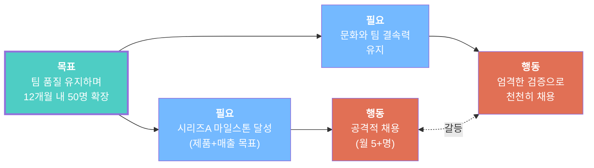
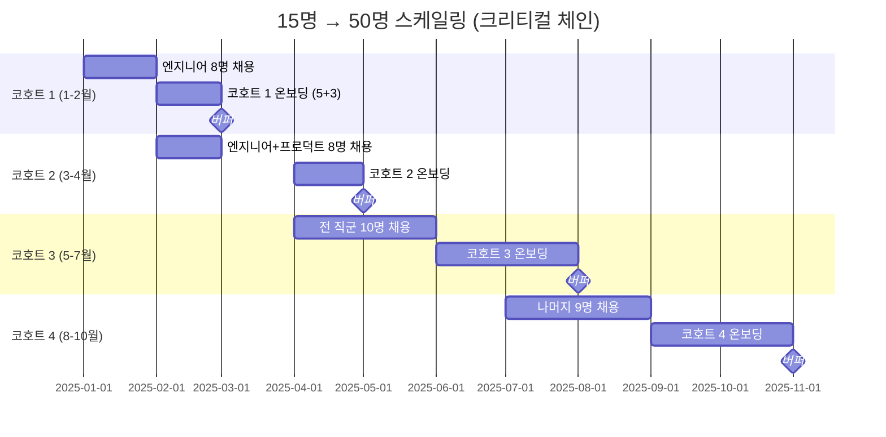

# 예제: 스타트업 스케일링 — 성장 vs 문화 유지

## 문제

> "15명 스타트업이 시리즈 A를 클로징했습니다. 마일스톤 달성을 위해 12개월 안에 50명으로 성장해야 합니다. 하지만 빠르게 채용할 때마다 문화가 악화되고, 부적합한 인재가 들어오고, 기존 팀원이 좌절합니다. 지난번 대량 채용 때 6개월 내 40%가 퇴사했습니다."

## 사용 도구: `/toc:ec` + `/toc:ccpm`

---

## 증발하는 구름

### 깨진 가정

**B→D**: "마일스톤 달성을 위해 월 5명 이상 채용해야 한다"
- "사람이 많을수록 산출물이 많다" → **거짓** (브룩스 법칙: 늦은 프로젝트에 인원을 추가하면 더 늦어진다)
- "35명 신규 채용 모두가 마일스톤에 필요하다" → **의심스러움** (구체적으로 어떤 마일스톤에?)

**D↔D'**: "빠른 채용과 엄격한 검증은 양립 불가"
- "엄격한 검증은 느리다" → **거짓** (구조화된 면접+평가표는 비구조화된 면접과 같은 시간이 걸린다 — 더 체계적일 뿐)

### 인젝션

> **연속 채용 대신 계획된 코호트(기수) 단위로 채용하되, 구조화된 면접 평가표를 사용하고, 온보딩을 분산하라. 제약은 채용 속도가 아니라 온보딩 역량이다.**

---

## 크리티컬 체인 분석

### 진짜 제약

스케일링의 병목은 채용(recruiting)이 아닙니다. **온보딩 역량** — 기존 팀원이 신규 입사자를 효과적으로 통합하는 능력 — 입니다.

현재 온보딩 제약:
- 신규 입사자당 첫 달에 1:1 멘토링 ~40시간 필요
- 멘토링 가능한 시니어 5명뿐
- 멘토 1명당 멘티 1명만 가능
- **제약 용량: 월 5명** (주 5명이 아님)

### 크리티컬 체인 프로젝트 계획

### 핵심 설계

1. **코호트(기수) 모델**: 연속이 아닌 8-10명 단위 배치 채용
   - 동기끼리 유대 형성 (문화 정착)
   - 온보딩이 구조화되고 반복 가능
   - 멘토에게 명확한 시작/종료일

2. **병렬 진행**: 현재 코호트 온보딩 중 다음 코호트 채용
   - 채용과 온보딩은 병렬 트랙
   - 제약(멘토)이 놀지 않음

3. **제약 확장**: 코호트 3부터 1기 졸업생이 멘토 역할
   - 멘토 용량: 5명 → 10명으로 성장
   - 자기 확장형 시스템

4. **프로젝트 버퍼**: 코호트 사이 1개월 버퍼
   - 채용 지연, 오퍼 거절, 조기 퇴사 흡수

---

## 결과 비교

| 지표 | 기존 방식 | CCPM 방식 |
|------|----------|----------|
| 50명 달성 | 7개월 (급하게) | 10개월 (계획적) |
| 6개월 이직률 | 40% | <10% (예상) |
| 생산성 도달 | 4-6개월 | 2-3개월 |
| 문화 점수 | 하락 | 안정/상승 |
| 마일스톤 리스크 | 높음 (이직으로 속도 파괴) | 낮음 (안정적 역량 성장) |

3개월 더 걸리지만, 거의 제로 이직률과 빠른 온보딩으로 **12개월 시점에서 더 많은 생산 역량**을 확보합니다.
