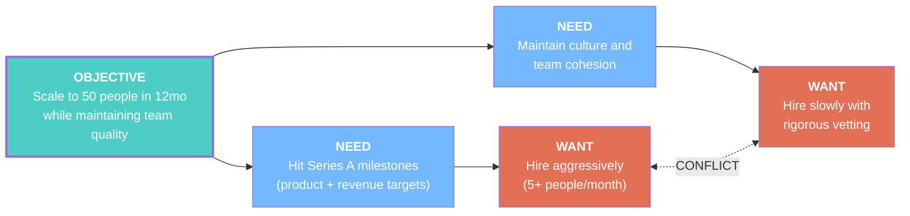
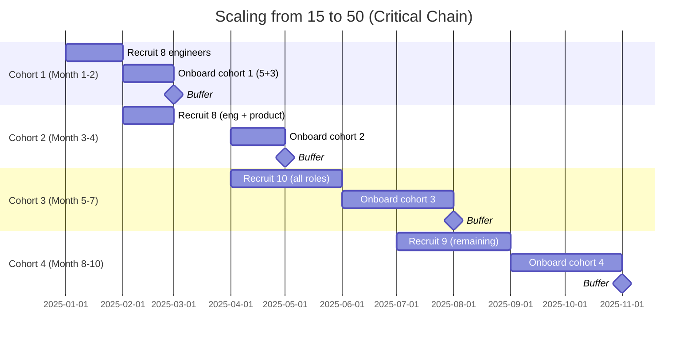

# Example: Startup Scaling — Growth vs. Culture

## Problem

> "We're a 15-person startup that just closed Series A. We need to grow to 50 people in 12 months to hit our milestones. But every time we hire fast, culture degrades, bad hires slip through, and existing team members get frustrated. Our last hiring push resulted in 40% turnover within 6 months."

## Tools Used: `/toc:ec` + `/toc:ccpm`

---

## Evaporating Cloud



### Assumptions Broken

**Arrow B→D**: "To hit milestones, we must hire 5+ people/month"
- Assumption: "More people = more output" → **FALSE** (Brooks's Law: adding people to a late project makes it later)
- Assumption: "All 35 new hires are needed for milestones" → **QUESTIONABLE** (which milestones specifically need more people?)

**Arrow D↔D'**: "Fast hiring and rigorous vetting are mutually exclusive"
- Assumption: "Rigorous vetting is slow" → **FALSE** (structured interviews with scorecards take the same calendar time as unstructured ones — they're just more disciplined)
- Assumption: "We can't parallelize hiring and onboarding" → **FALSE**

### Injection

> **Hire in planned cohorts (not continuously), with structured interview scorecards, and stagger onboarding. The constraint is not hiring speed — it's onboarding capacity.**

---

## Critical Chain Analysis of the Hiring "Project"

### The Real Constraint

The bottleneck in scaling is NOT recruiting. It's **onboarding capacity** — the ability of existing team members to integrate new hires effectively.

Current onboarding constraint:
- Each new hire needs ~40 hours of 1:1 mentoring in first month
- Only 5 senior team members can mentor
- Each mentor can handle 1 mentee at a time
- **Constraint capacity: 5 new hires per month** (not per week)

### Critical Chain Project Plan



### Key Design Decisions

1. **Cohort model**: Hire in batches of 8-10, not continuously
   - New hires bond with their cohort (culture formation)
   - Onboarding is structured and repeatable
   - Mentors have defined start/end dates

2. **Staggered recruitment**: Start recruiting next cohort while onboarding current one
   - Recruiting and onboarding are parallel tracks
   - The constraint (mentors) is never idle

3. **Expanding the constraint**: By cohort 3, first hires become mentors
   - Cohort 1 graduates become mentors for Cohort 3
   - Constraint capacity grows from 5 to 10 mentors

4. **Project buffer**: 1-month buffer between each cohort
   - Absorbs recruitment delays, rejected offers, early departures
   - Managed by green/yellow/red zones

### Buffer Management

```
Cohort 1 Recruitment:  [████████░░░░] 35% buffer remaining (GREEN)
Cohort 1 Onboarding:   [██████████░░] 15% buffer remaining (YELLOW) ⚠️
Cohort 2 Recruitment:   [████████████] 100% buffer remaining (GREEN)

Action for Yellow:
  Mentor capacity stretched — 2 mentees showing slower ramp
  → Assign peer buddy (non-mentor support) for admin questions
  → Reserve mentor time for technical deep dives only
```

---

## Combined Recommendation

### What We're NOT Doing
- ~~Hire 5 people per week for 7 weeks~~ (culture killer)
- ~~Hire slowly, 1-2 per month~~ (miss milestones)

### What We ARE Doing
1. **Cohort-based hiring**: 4 cohorts of 8-10 over 10 months
2. **Structured interviews**: Same scorecard for all candidates (fast AND rigorous)
3. **Onboarding as constraint**: Protect mentor time, stagger cohorts
4. **Self-expanding**: Each cohort produces mentors for the next

### Expected Results

| Metric | Old Approach | CCPM Approach |
|--------|-------------|---------------|
| Time to 50 | 7 months (rushed) | 10 months (planned) |
| 6-month turnover | 40% | <10% (projected) |
| Ramp-to-productive | 4-6 months | 2-3 months |
| Culture scores | Declining | Stable/improving |
| Milestone risk | High (churn destroys velocity) | Low (reliable capacity growth) |

The 3-month longer timeline is MORE than offset by near-zero turnover and faster ramp times. Net: **more productive capacity** at month 12.
